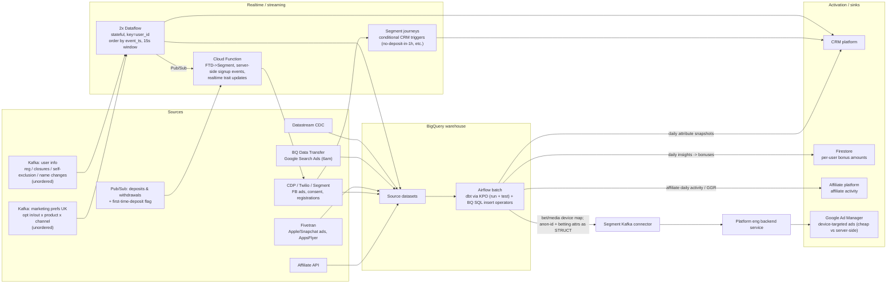
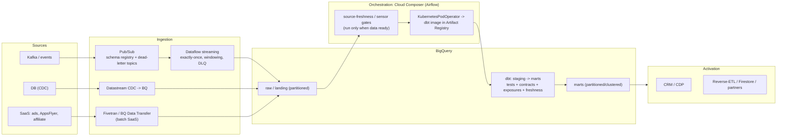

# Data platform architecture — previous → best-practice (GCP)

Visualises a previous production architecture at a sports betting + media company (see `architecture_previous.md` for the raw notes) and a
best-practice target on GCP. Items the user labelled **before** vs **new** are answered as
before → best-practice throughout.

---

## 1. Previous architecture

**Spec notes:** Dataflow stateful ordering (15s window on `event_timestamp`) handled out-of-order Kafka;
BQ auto-sharding sink; Segment as the realtime event bus / CDP. Airflow for all batch — **dbt models via
KubernetesPodOperator (`dbt run` + `dbt test`)** for the two dbt models (affiliate daily activity;
media-app activity keyed on anonymous_id into a STRUCT), everything else via BQ SQL insert operators. Full
detail + per-source diagram in [`architecture_previous.md`](architecture_previous.md).

---

## 2. Best-practice target architecture (GCP)

**Cross-cutting (kept out of the diagram for readability, detailed in §4):** Dataplex governance
(policy tags, masking, row access policies, DLP); Cloud Monitoring/Logging + log-based metrics + Slack
alerts; VPC-SC + private subnets + NAT; Workload Identity / WIF (keyless); Terraform per-component state.

---

## 3. dbt + BigQuery STRUCT schema evolution (the question from the notes)

**Q: if I add a field to a STRUCT in a dbt model's SELECT, will dbt add it to the existing table's struct
automatically?** **No.**

- dbt's `on_schema_change` (`append_new_columns`, `sync_all_columns`, …) tracks **top-level columns only**.
  A new field *inside* a STRUCT is a nested change → **not detected**, so dbt won't ALTER it. An incremental
  run whose SELECT now yields `STRUCT<a,b,c>` against a target `STRUCT<a,b>` will **fail** on type mismatch.
  ([dbt-bigquery #446](https://github.com/dbt-labs/dbt-bigquery/issues/446);
  [docs](https://docs.getdbt.com/docs/build/incremental-models))
- It "just worked" in **Terraform** because TF issues a BigQuery **schema patch** (Tables.patch / `bq update`
  with a JSON schema) that adds the new **NULLABLE** nested field non-destructively. BigQuery supports adding
  nested fields, but not cleanly via `ALTER TABLE ADD COLUMN struct.field` — it needs the schema-update path.
  ([modifying schemas](https://docs.cloud.google.com/bigquery/docs/managing-table-schemas))

**Practical options (best → situational):**
1. **Materialize that model as `table` (full rebuild), not incremental.** The struct is recreated every run,
   so a new SELECT field simply appears — zero schema-evolution code. Best when the table is small enough.
2. **Keep Terraform owning the table schema** (patch the struct), and have dbt `insert`/`merge` into it. This
   is what you did; it works because TF adds the field first, then dbt writes it.
3. **dbt `pre_hook`** that patches the schema before the incremental write (a macro calling `bq`/Tables.patch
   or `ALTER TABLE … ADD COLUMN` where supported), so it's dbt-owned and in version control.
4. **`--full-refresh`** the model on the deploy that changes the struct (the `force_full_refresh` var the
   repo already wires supports this).

Recommendation for the media-app-attributes model: if it's incremental for cost, use option 1 if feasible,
otherwise option 3 (dbt-owned pre-hook) so schema + transform live together rather than split across TF.

---

## 4. Common baseline → best-practice, by concern

### 4.1 Orchestration (is Prefect / Dagster considered?)
| | Detail |
|---|---|
| Common baseline | Airflow (Composer) for all batch; BQ SQL insert operators alongside a handful of dbt models |
| Best practice | **Airflow/Composer** remains the safe GCP-managed default (mature, sensors, huge ecosystem). For a **dbt-centric** stack, **Dagster** is the strongest alternative: software-defined **assets** give a native per-model dbt asset graph + lineage + better local testing (managed via Dagster+ or self-hosted on GKE). **Prefect** is lighter/Pythonic, great for dynamic/ML flows, but weaker on asset/lineage modelling. |
| Verdict | Stay on Composer if you value managed + existing ops; pick **Dagster** if dbt lineage/asset observability is the priority and you'll run it on GKE/Dagster+. Run dbt via **KubernetesPodOperator + image** (this repo) regardless — keeps dbt off the scheduler. |

### 4.2 Governance (AWS Lake Formation → GCP)
| Lake Formation feature | GCP equivalent (best practice) |
|---|---|
| Role-based grants | IAM (groups/roles) + BigQuery dataset/table grants |
| Column filtering / masking | **BigQuery column-level security** via **policy tags** in a **Dataplex** taxonomy + **dynamic data masking** data policies (redact/nullify/hash/UDF, at query time, role-based — `Fine-Grained Reader` vs `Masked Reader`) |
| Row filtering | **Row access policies** |
| Catalog / classification / lineage | **Dataplex (Universal Catalog)** + **Sensitive Data Protection (DLP)** for PII discovery & auto-tagging |
| Rollout | Use policy-tag **monitor-only mode** before enforcing |

Pattern: a small **taxonomy of data classes** (e.g. `pii.email`, `pii.name`, `financial`), tag columns once,
attach masking policies per role. Tag dbt models via `meta`/`policy_tags` in schema YAML so tags are
version-controlled and reapplied by dbt/Terraform.

### 4.3 Monitoring / alerting (Teams/Slack on AWS → GCP)
| Common baseline | Best practice on GCP |
|---|---|
| Slack alerts; metrics + log error counts via Terraform; sensors + source checks so DAGs run only when data ready | **Cloud Monitoring + Cloud Logging**: log-based metrics on error counts; **alerting policies → Slack** (Monitoring Slack channel, or Pub/Sub → Cloud Function/webhook). Keep the **sensor / `dbt source freshness` gating** (it's already best practice). Add **dbt artifacts / Elementary** for test+freshness dashboards and anomaly alerts; SLOs on freshness/latency. Define all of it in Terraform. |

### 4.4 Data quality (custom SQL checks → dbt tests)
| Common baseline | Best practice |
|---|---|
| Custom SQL checks in Airflow tasks | **dbt tests** (generic + `dbt_utils`/`dbt_expectations` + singular), **enforced contracts** on marts, **source freshness**, and **`dbt build`** (test-blocks-downstream). Layer **Elementary** for volume/anomaly monitoring. Gate orchestration on freshness; fail the run on test failure. Keep a few **business-rule singular tests** (e.g. GGR = stake − payout) like this repo has. |

### 4.5 Security (subnet → vulnerability checks)
| Common baseline | Best practice |
|---|---|
| Workloads in a private subnet behind a NAT gateway | Keep private subnets + Cloud NAT; add **VPC Service Controls** perimeter around BQ/GCS to stop exfiltration; **Private Google Access / Private Service Connect**. **Keyless auth everywhere** — **WIF/OIDC** for CI/CD, **Workload Identity** for workloads (no JSON keys). **Vulnerability checks**: enable **Artifact Registry container scanning** (+ block-on-CVE), add **Trivy/Grype** in CI, **Dependabot/renovate**, and SAST (CodeQL); secrets in **Secret Manager**, secret scanning on. |

### 4.6 Code quality (ruff + unit tests → + sqlfluff, DAG parse)
| Common baseline | Best practice |
|---|---|
| ruff; unit tests gating CI/CD | Keep ruff + unit tests. Add **SQLFluff** (dbt templater) for SQL; **DAG-integrity tests** (DagBag import — catches real import errors, stronger than AST parse alone) — this repo does AST compile locally + DagBag import in CI; **pre-commit** for fast local gates; **dbt build on DuckDB/ephemeral dataset in CI** + **Slim CI** (`state:modified+`) to test only changed models; **dbt-checkpoint** for model docs/test coverage. |

---

## 5. Terraform: service accounts & state (medium-size org)

**Auth:** replace long-lived JSON keys and a single over-privileged service account with:
- **CI/CD authenticates via WIF/OIDC** (GitHub → GCP), then **impersonates** a per-environment Terraform SA
  (`tf-deployer-{dev,stg,prod}`) — short-lived tokens, repo/branch-scoped, nothing stored, nothing to rotate.
- **Least privilege per environment**, ideally per-component; avoid project Owner. Prod applies only from
  `main` via CI, never local.

**State layout (avoiding concurrent-apply conflicts):**
- **One state per component × environment**, not a monolith — e.g. `networking/`, `bigquery/`, `composer/`,
  `dataflow/`, each with its **own** GCS backend prefix per env. Smaller blast radius, parallel-safe across
  components, faster plans.
- **GCS backend with state locking + object versioning** so concurrent `apply` on the *same* state
  serialises (no clobbering) and you can roll back.
- **Dev concurrency**: engineers clobbering each other's infrastructure comes from sharing one mutable dev environment with **local
  applies**. Fix with either (a) **per-developer ephemeral stacks** (Terraform workspaces or a
  `-${var.developer}` suffix / separate sandbox projects), or (b) **a single shared dev where only CI
  applies** (PR plan → merge apply), so applies serialise behind locking. (a) scales better for a team.
- Structure as reusable **modules** + thin per-env root configs; pin provider versions; `terraform plan` on
  PR as a required check.

---

## 6. Batch vs streaming on GCP — best-practice checklist

**Batch (BigQuery + dbt + Composer):**
- EL with Datastream (CDC) / Fivetran / BQ Data Transfer into a **partitioned** `raw` layer.
- Transform with **dbt** (staging → marts), **incremental** with `insert_overwrite` + date `partition_by`
  (idempotent), **partition + cluster** marts, tests + contracts + freshness.
- Orchestrate with **Composer**, **gated on source freshness/sensors**, dbt via **KubernetesPodOperator**.
- Cost: partition pruning, clustering, `--select state:modified+` Slim CI, BI Engine/materialized views where
  it pays.

**Streaming (Pub/Sub + Dataflow):**
- **Pub/Sub** ingress with a **schema** and **dead-letter topics**; **Dataflow** (Apache Beam) for
  stateful/windowed processing with **exactly-once**, event-time windows + watermarks for out-of-order (your
  15s-window pattern, done right), and a **DLQ** sink.
- Sink to BQ via the **Storage Write API** (not legacy streaming inserts); autoscaling + Streaming Engine.
- For lighter cases, **Pub/Sub → BigQuery subscription** (no Dataflow) or **Dataflow templates**.
- Observability: Dataflow job metrics + backlog/watermark alerts; DLQ alerts.

---

## 7. dbt model best practices (target)
- **Layering**: `staging` (views, 1:1, rename/cast) → `intermediate` (ephemeral) → `marts` (incremental
  tables). One source of truth per concept.
- **Incremental + idempotent**: `insert_overwrite` + `partition_by` (BQ) driven by the run's data interval;
  `unique_key`; `on_schema_change='append_new_columns'` (top-level only — see §3 for structs).
- **Contracts** on marts (typed columns, enforced); **exposures** for downstream BI; **source freshness**.
- **Tests**: generic + `dbt_utils`/`dbt_expectations` + singular business rules; `dbt build` so tests block
  downstream.
- **Docs**: a description on every column + reusable `` blocks; `persist_docs` to BigQuery.
- **Governance**: attach **policy tags** in schema YAML so column security is version-controlled.
- **Performance/cost**: partition + cluster, avoid `select *` in marts, prune early, Slim CI.
- **Lineage/observability**: Elementary or dbt artifacts; (Dagster if you want native asset lineage).

---

## 8. Running dbt today (2026): dbt Cloud vs dbt Core on GCP

**Landscape:** Fivetran and dbt Labs **completed their merger (1 June 2026)** into one "open data
infrastructure" company. The big technical shift is the **dbt Fusion engine** — a Rust rewrite that parses
SQL ~30x faster, validates SQL in real time without a warehouse run, and adds state-aware orchestration;
**dbt Core v2.0** open-sources the Fusion runtime (Apache 2.0). Whichever path you pick, runs are moving onto
Fusion.

**What teams actually use:** a spectrum, not one answer.
- **dbt Cloud / "dbt platform" (managed):** web IDE, scheduler, CI, semantic layer, dbt Mesh, Fusion. Good if
  you want managed + minimal infra (per-seat cost). Even here, best practice is **not** to rely on its
  scheduler for enterprise orchestration — trigger dbt from your orchestrator after ingestion completes.
- **dbt Core + your orchestrator (the common enterprise pattern):** own the infra, trigger dbt after EL.

**Best ways to run dbt Core on GCP/BigQuery** (pick by ops appetite):

| Option | What | Best when |
|---|---|---|
| **Cloud Run Jobs** | run the dbt **container** (this repo's image) as a serverless job; trigger via Cloud Scheduler / Workflows / Composer (`CloudRunExecuteJobOperator`) | **lightest** — no cluster, scale-to-zero, <=24h, pay-per-use; a natural upgrade from KPO if you don't want GKE |
| **Composer + KubernetesPodOperator** (this repo) | dbt image as pods on Composer's GKE | already on Composer; want Airflow sensors + DAG ecosystem |
| **Composer + Cosmos** | each dbt model = an Airflow task | want per-model observability inside Airflow |
| **Dagster + dbt** | software-defined assets, native dbt asset graph + lineage | dbt-centric stack; best lineage/observability (OSS or Dagster+) |
| **dbt Cloud / platform** | fully managed | want managed + semantic layer + Fusion, least infra |

**Recommendation for you:** you already have a **dbt container image**, so **Cloud Run Jobs** is the lightest
"better way to implement dbt Core" on GCP — serverless, no GKE, cheap — with **Composer triggering the job**
(keeping your freshness/sensor gating). Choose **Dagster** instead if asset-level lineage/observability is the
priority; **dbt Cloud** if you'd rather pay for managed + the semantic layer.
