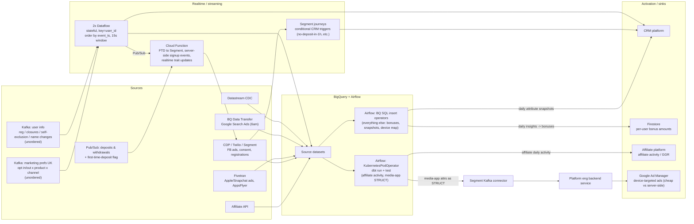

# Previous architecture

What I implemented and had running at a previous employer (sports betting + media). Companion to
[`architecture.md`](architecture.md), which holds the best-practice target + the before→best-practice
breakdown. dbt models here ran via **KubernetesPodOperator** executing **`dbt run` + `dbt test`**; everything
else ran via **Airflow BigQuery SQL insert operators**.

## Diagram

## Sources
1. **Kafka — user info**: status updates (reg, account open/closures, self-exclusions, name changes). Unordered.
2. **Kafka — marketing preferences (UK)**: opt in/out per product (sport, casino) and channel (SMS, email, phone). Unordered.
3. **Pub/Sub — deposits/withdrawals** with first-time-deposit flag.
4. **Datastream CDC** → BigQuery source datasets.
5. **Google Search Ads** via BQ Data Transfer at 6am daily → BigQuery source dataset.
6. **Fivetran sync** — Apple Search Ads, Snapchat ads, AppsFlyer events (app installs, registrations) → BQ source dataset.
7. **Facebook ads** source sync (from CDP/Twilio/Segment) → BQ source dataset.
8. **Affiliate API** data → BQ source dataset.
9. **CDP/Twilio/Segment** event data (consent preferences, registrations).

## Realtime / streaming
1. **2× Dataflow** (one each for user info + marketing prefs): stateful function keyed on `user_id`, ordering
   messages on `event_timestamp` in a 15s window (messages often out of order). Written to BigQuery
   (auto-sharding), a Pub/Sub topic, and the CRM platform.
2. **Cloud Function**: consumed first-time-deposit messages → FTD events to Segment; consumed user-info
   messages → server-side "signed up" events; realtime trait updates (account_open, first_name, last_name…).
3. **Segment journeys**: consumed server-side signup events, deposit events, account statuses, KYC status →
   conditionally sent a user-reg event and a "no deposit within 1h of registering" trigger to the CRM platform.

## Batch (Airflow)
**dbt models — KubernetesPodOperator running `dbt run` + `dbt test`:**
- **Affiliate daily activity** — affiliate-acquired users' daily deposit/withdrawal/betting/GGR →
  the affiliate platform.
- **Media-app activity** — keyed on Segment **anonymous_id**, writing updated attribute values into a
  BigQuery **STRUCT** (the schema-evolution test, below).

**BigQuery SQL insert operators (everything else):**
- Daily **insights** on betting activity per user → bonus amounts → updated **Firestore** doc per user
  (free-to-play game bonuses).
- Ingest betting-app user details/activity → **daily attribute snapshots** → call the CRM platform to update
  user profile attributes.
- **Bet ↔ media device mapping** via Segment identify events imported into BigQuery (links betting activity
  to media-app activity by device ID).
- Using those mappings, export media-app anonymous_id + betting attributes to the **Segment Kafka
  connector** → platform engineering backend → on media-app open, injects **Google Ad Manager** attributes
  for personalised ads (much cheaper per serving than a server-side approach).

## The STRUCT schema-evolution test (why this repo exists)
The media-app model wrote updated attribute values into a BigQuery **STRUCT** keyed on `anonymous_id`. The
open question: **if you add a field to that STRUCT in the dbt SELECT, will dbt automatically add it to the
BigQuery table — a new column at the end of the struct?**

**Answer: no.** dbt's `on_schema_change` tracks **top-level columns only**; a new field *inside* a STRUCT is
not detected, so an incremental run fails on the type mismatch instead of evolving the struct. In BigQuery
SQL this needs a schema-update (≈2 DDL steps); it "just works" in **Terraform** because TF issues a BigQuery
schema patch that adds the nullable nested field. Full reasoning + the dbt-native workarounds are in
[`architecture.md` §3](architecture.md).
